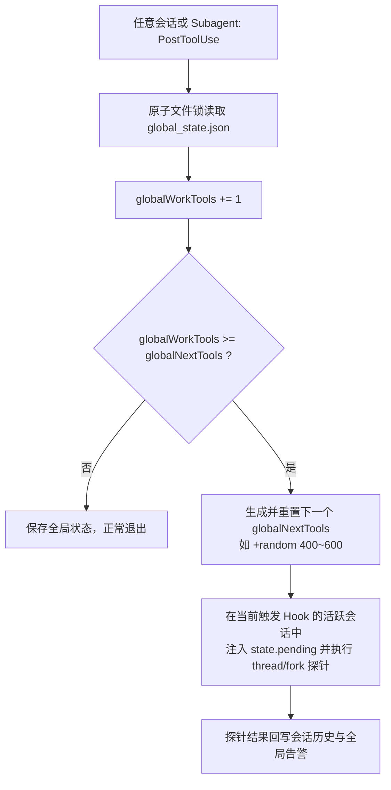

# ModelTrace Guard 全局计数器（Global Tool Counter）改造方案

## 1. 背景与现状问题

### 1.1 现状：会话级（Per-Session）计数
目前 ModelTrace Guard 采用严格的会话级隔离（`~/.codex/modeltrace-guard/<session_id>.json`）：
- 每个会话独立累计 `workTools`，在 `workTools >= nextTools` 时触发指纹探针抽样。
- **实际会话分布（基于过去 24 小时 81 个活跃会话）**：
  - 中位数仅 **21 次** 工具调用，近 80% 的任务是短任务（0 ~ 30 次）。
  - 全局总工具调用量却高达 **3,947 次**（存在 606 次、397 次等极长编码任务）。

### 1.2 核心痛点
1. **短任务与 Subagents 严重漏检**：
   若阈值设为 150~300，80% 以上的普通对话和自动派生的子任务（生命周期通常 5~20 次工具）永远达不到阈值，无法被探针覆盖。
2. **长任务抽样分布不均**：
   超长会话（如 600+ 工具）会被连续抽取多次，而短任务完全空白。
3. **24h 触发频率不可控**：
   如果当天拆分了大量短任务，探针触发数为 0；如果当天集中在单个长任务，探针触发数激增。

---

## 2. 全局计数器设计方案

### 2.1 核心思想
将“工具调用的累计与排期”从**单会话状态**提升至**全局原子计数器**，但将“指纹探针的实际执行”保持在**当前触发阈值的活跃会话（现场快照分支）**上。



### 2.2 数据模型：`~/.codex/modeltrace-guard/global_state.json`

```json
{
  "schema": 1,
  "globalWorkTools": 1520,
  "globalNextTools": 1850,
  "lastProbeAt": 1790296000000,
  "lastProbeSession": "01a0d3d3-e856-7473-9b6d-5197741e5cb2",
  "totalProbesIssued": 4,
  "config": {
    "globalToolMin": 400,
    "globalToolMax": 600
  },
  "recentAlerts": []
}
```

### 2.3 核心实现细节

#### 1. 并发安全（Atomic Locking）
Codex 可能同时运行多个子任务或后台线程，因此全局计数器的自增与判定需使用原工程既有的 `withLock` 或基于 `fs.open(..., 'wx')` 的原子文件锁（如 `global.lock`），锁超时时间设为 100ms，超时未获取则退化丢弃本次单次计数，避免阻塞主业务工作流。

#### 2. 现场快照执行（Context-preserving Probe）
当 `globalWorkTools >= globalNextTools` 时：
1. 消费该触发点，立即重新掷骰子生成下一个全局目标：
   `globalNextTools = globalWorkTools + randomInt(globalToolMin, globalToolMax + 1)`
2. 将当前事件所属的 `event.session_id` 作为宿主：
   调用 `issue(state, now)`，直接利用该会话当前的 `thread/fork` 上下文进行现场指纹验证。
3. 如果当前会话处于无法采样状态（例如正在 compact 或已结束），仅重置全局目标，等待下一个活跃会话触发。

#### 3. 告警传播（Global Alerting & Halt）
- 若某次抽样确认服务端发生模型降智（`difference_signal` / `repeated_difference`）或 SQLite 遥测报警：
  - 写入全局 `recentAlerts`；
  - 任何其他会话在下一次 `PreToolUse` 或 `UserPromptSubmit` 时，检测到全局存在未确认告警，即刻提示用户。

---

## 3. 阈值设定与预期效果

基于全机 24h 约 4,000 次工具调用的基准：

| 全局阈值区间 (`globalToolMin ~ Max`) | 平均触发间隔 | 24h 预计触发总数 | 覆盖情况 |
| :--- | :--- | :--- | :--- |
| **`350 ~ 450`** | 400 次 | **~10 次** | 贴近每日 10 次上限 |
| **`400 ~ 600`（推荐）** | 500 次 | **~8 次** | 极度平稳，每约 500 次工具严格触发 1 次 |
| **`700 ~ 900`** | 800 次 | **~5 次** | 超轻量，低频静默 |

### 收益总结
1. **绝对可控**：24h 总探针数与用户总工作量严格线性相关，不受切窗口或子任务拆分的影响。
2. **零死角覆盖**：即使用户连续开了 20 个短会话，累积到 500 次工具时依然会自动抽样一次，彻底杜绝短任务漏检。
3. **架构解耦**：无需改造 Codex 核心，仅在 Guard Hook 插件内部将计数器由单文件变更为共享原子文件。
